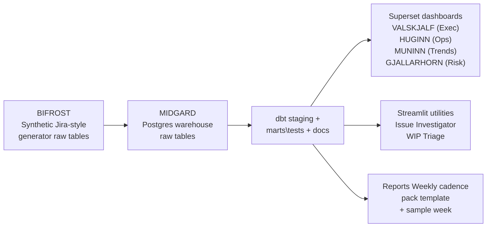
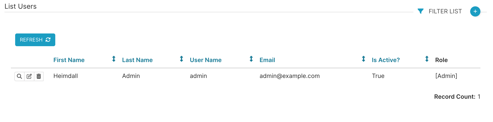
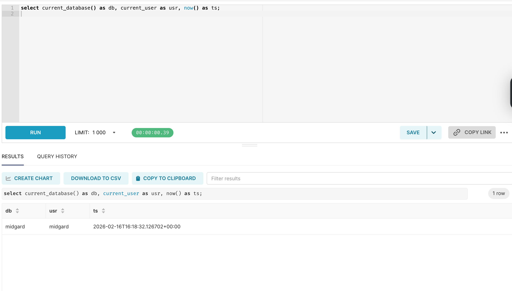
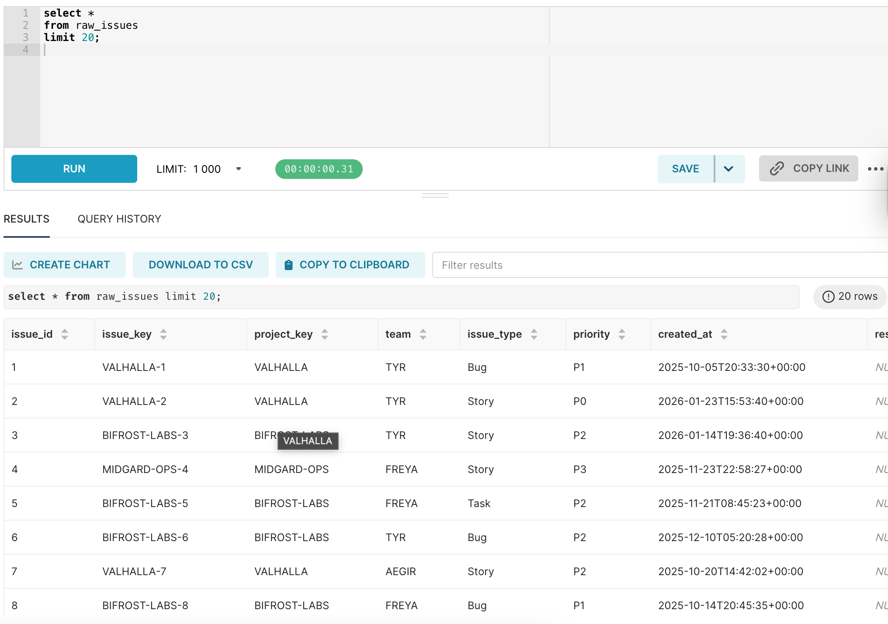
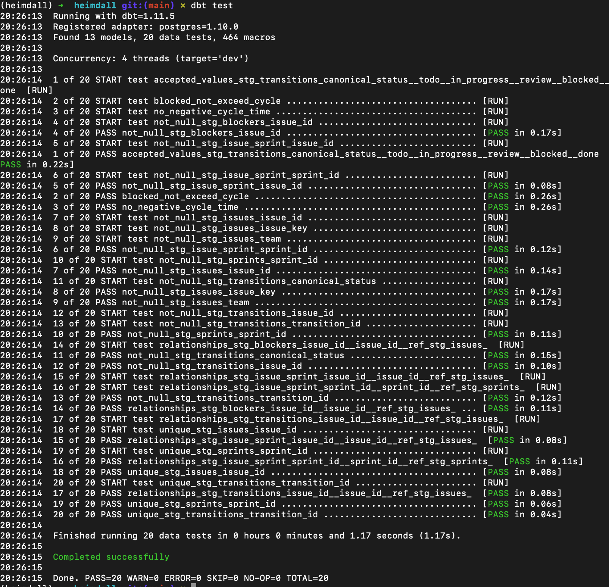
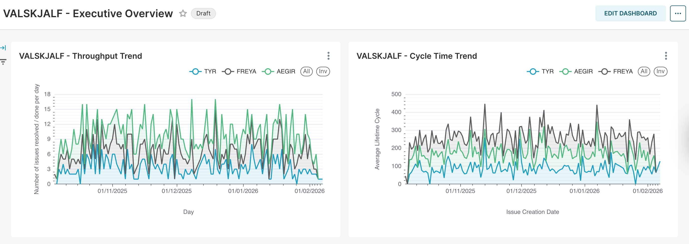
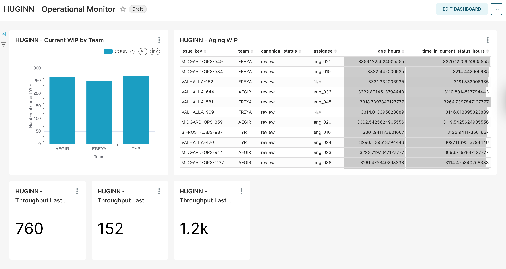
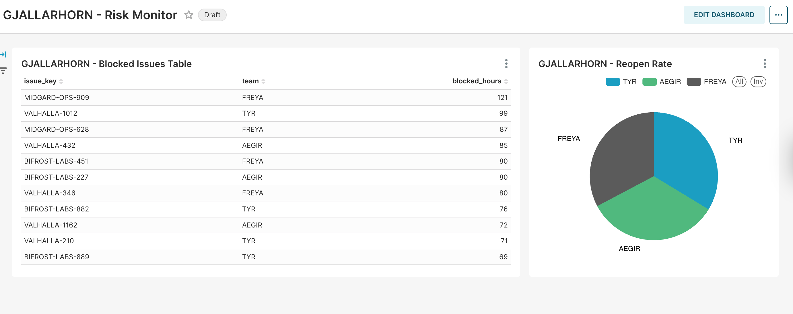
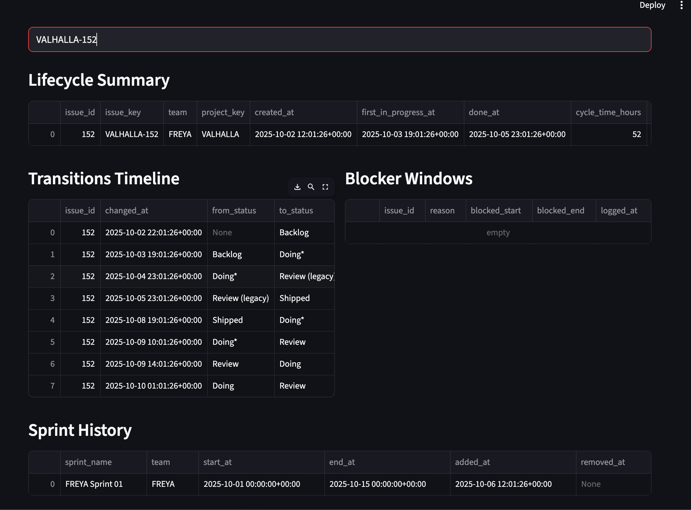
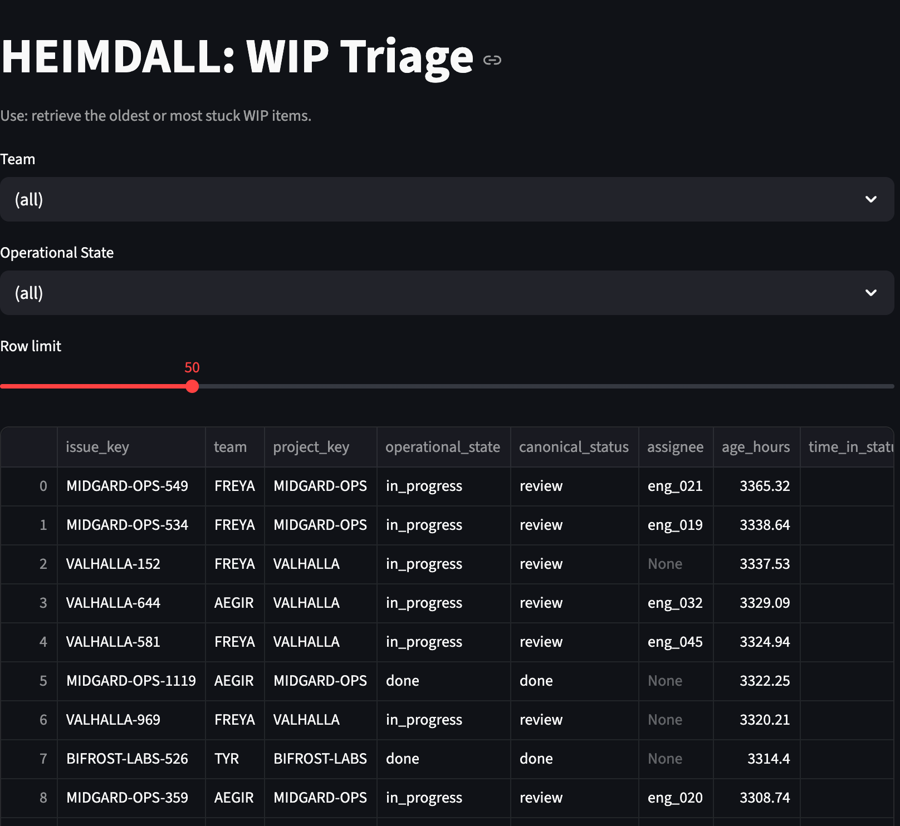

<p align="center">
  
</p>

<h1 align="center">HEIMDALL</h1>
<p align="center"><strong>Engineering Delivery Intelligence</strong> | Jira-style event logs | warehouse facts | decision-ready dashboards | investigation tools</p>

<p align="center">
  
  
  
  
  
  
  

</p>


***


HEIMDALL transforms raw Jira-style delivery logs into trustworthy operational intelligence. It provides a reproducible warehouse, governed metrics, executive dashboards, and investigation tools that help engineering teams understand delivery performance, identify risk, and make more effective operational decisions.

---

## The Purpose of HEIMDALL

Engineering delivery data is event-based, tends to be messy, inconsistent, and easily misinterpreted.

Jira, among similar tools record operational transitions rather than metrics. Simple dashboard queries often produce misleading conclusions because they can ignore delivery state transitions, reopenings of issues, blocker windows, and inconsistent workflows.

HEIMDALL aims to solve this ambiguity by building delivery intelligence from first principles. 

It converts raw lifecycle events into validated warehouse models that define delivery metrics within the contextual Jira framework.

Therefore, HEIMDALL is a system that can answer operational questions such as:

- Is delivery slowing down?
- Where is work getting stuck?
- Are blockers increasing?
- Is throughput improving?

---


## Repository Structure

```text
├── bifrost
│   ├── README.md
│   ├── __init__.py
│   ├── config.yml
│   ├── dictionary.md
│   ├── generate.py
│   ├── load.py
│   ├── schema.sql
│   └── scripts
├── dbt
│   ├── heimdall
│   │   ├── README.md
│   │   ├── analyses
│   │   ├── dbt_project.yml
│   │   ├── logs
│   │   ├── macros
│   │   ├── models
│   │   ├── seeds
│   │   ├── snapshots
│   │   ├── target
│   │   └── tests
├── docker-compose.yml
├── docs
├── environment.yml
├── reports
│   ├── sample_week.md
│   └── weekly_update_template.md
├── streamlit_dash
│   ├── __init__.py
│   ├── common
│   │   ├── __init__.py
│   │   ├── db.py
│   │   └── queries.py
│   ├── issue_investigator.py
│   └── wip_triage.py
└── superset
    ├── init
    │   └── 01_init_superset.sh
    └── superset_config.py
```

---

## Architecture



---

## Core Components

### BIFROST - Data Generation and Ingestion

This first layer in the HEIMDALL architecture generates deterministic and reproducible Jira-adjacent data, simulating a realistic engineering delivery environment.

**BIFROST Includes:**

- Incomplete lifecycle histories
- Reopened issues
- Inconsistant delivery status naming
- Sprint scope changes
- Blocker windows
- Missing assigments

This means the downstream warehouse logic can handle realistic mess rather than idealistic, perfectly clean data.

**Raw tables:**

- `raw_issues`
- `raw_transitions`
- `raw_sprints`
- `raw_issue_sprint`
- `raw_blockers`

---

### MIDGARD - Warehouse

PostgreSQL provides the analytical foundation, and dbt transforms the raw logs into warehouse models.

**Fact tables:**

- `fct_issue_lifecycle`
- `fct_throughput_daily`
- `fct_wip_daily`
- `fct_wip_current`
- `fct_sprint_performance`

**Dimension tables:**

- `dim_team`
- `dim_project`
- `dim_milestone`

All models are tested and documented.

---

## Dashboards

Dashboards on Superset include:

- **VALSKJALK - Executive Dashboard**
- **HUGINN - Operational Monitor**
- **MUNINN - Historical Trends**
- **GJALLARHORN - Risk Detection**

---

### Streamlit Investigation Tools

The dashboards show the trends. Whereas, the investigation tools explain causes.

#### Issue Investigator

Displays the complete lifecycle of a single issue:

- state transitions
- blocker periods
- reopenings
- sprint history

#### WIP Triage

Identifies the oldest and riskiest work items. Used to diagnore WIP flow.

---

## Delivery Metric Definitions

The delivery metrics are defined explicitly and computed from events logs.

Examples:

- **Cycle Time:** Time from first in-progress status to done.
- **Throughput:** Completed issues per time period.
- **Blocked Time:** Total time issues were blocked.
- **Rework Rate:** Percentage of issues reopened after an initial completion.

---

## Example Weekply Report Insight

HEIMDALL detect delivery degradation indication patterns such as:

- throughput collapse
- cycle time increase
- WIP overload

This is beneficial for preventative intervention measures. Without systems like HEIMDALL, the operational behaviours that influence delivery failure often remand hidden.

---

## Running HEIMDALL

### Start Infrastructure

```bash
docker compose up -d
```

**Services:**
- Postgres
- Superset

---

### Generate Synthetic Data

```bash
python -m bifrost.generate
```

---

### Build Warehouse

```bash
cd dbt/heimdall
dbt run
dbt test
```

---

### Launch Dashboards

**Superset dashboard tool:**
**Open:**

```text
http://localhost:8088

```

---

## Screenshot gallery

> All screenshots are from a fresh local run using the reproducible Docker + dbt workflow.

### Stack bring-up and connectivity
| Step | Screenshot |
|---|---|
| Superset running |  |
| MIDGARD DB connection success |  |

### Raw data realism 
| Step | Screenshot |
|---|---|
| raw_issues preview (missing fields, drift) |  |

### Warehouse validation
| Step | Screenshot |
|---|---|
| dbt tests passing |  |

### Dashboard suite
| Dashboard | Screenshot |
|---|---|
| VALSKJALF (Executive Overview) |  |
| HUGINN (Operational Flow Monitor) |  |
| MUNINN (Historical Trends) |  |
| GJALLARHORN (Risk Monitor) |  |

### Investigation tools
| Tool | Screenshot |
|---|---|
| Issue Investigator |  |
| WIP Triage |  |


---

## Example weekly delivery report

HEIMDALL produces decision-ready weekly delivery summaries built directly from warehouse metrics.

📄 **Full PDF report:** [Download sample_week.pdf](reports/sample_week.pdf)


Preview:

---

### Executive Summary (excerpt)

Overall delivery performance degraded this week. Throughput fell sharply from 64 to 26 completed items, while median cycle time increased from 75 to 81 hours, indicating slower delivery across the system.

Total work in progress remains extremely high at 791 items, suggesting the system is overloaded and work is not flowing efficiently.

The primary risk is excessive work in progress. The recommended action is to prioritise finishing existing work and actively triage the oldest in-progress and blocked items.

---

### Headline Metrics

| Metric | This week | Last week | Δ |
|---|---:|---:|---:|
| Throughput | 26 | 64 | -38 |
| Median cycle time | 81 | 75 | +6 |
| P75 cycle time | 101 | 100.5 | +0.5 |
| Current WIP | 791 | — | — |
| Blocked share | 2.83% | 3.06% | -0.23 |
| Rework rate | 0% | 25% | -25 |

---


