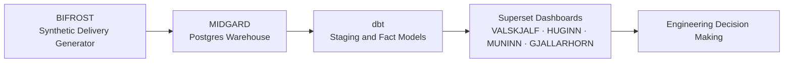
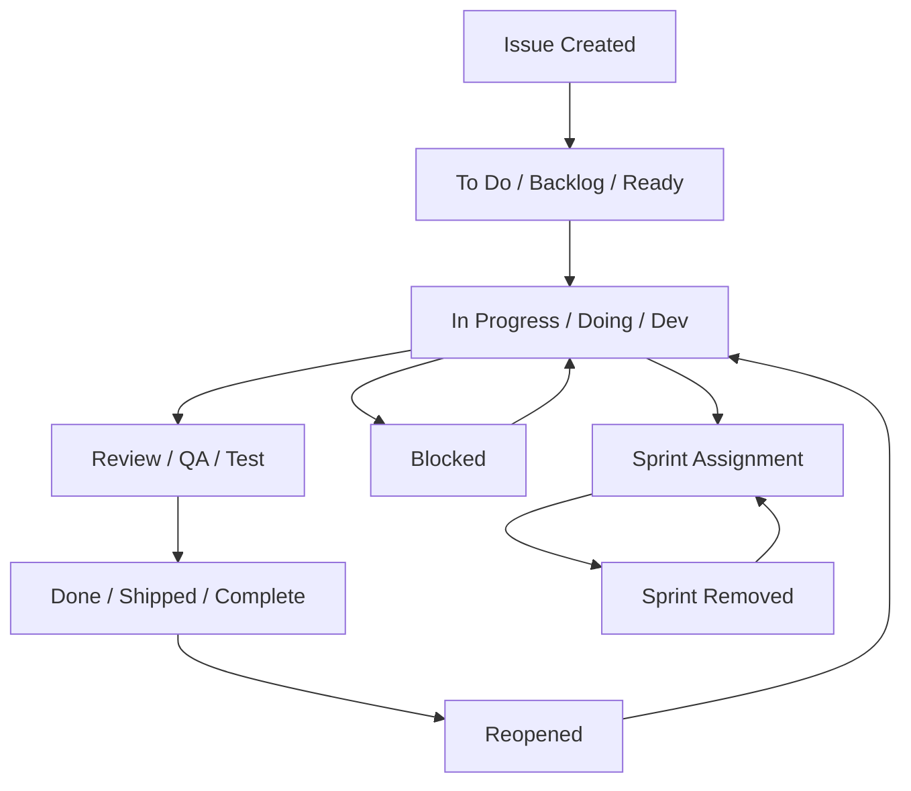
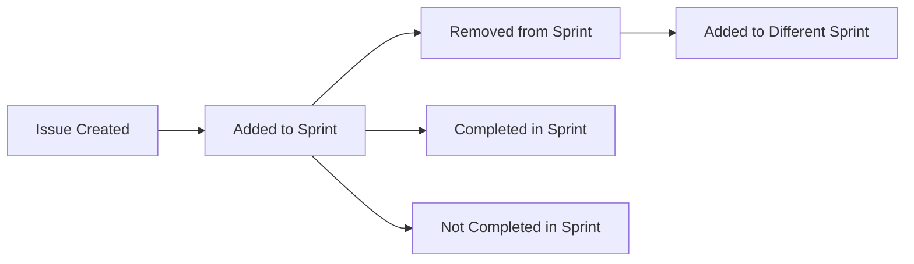

***
# BIFROST
***

**BIFROST is a synthetic Jira stylised delivery event generator and data ingestion layer for HEIMDALL.**

BIFROST is the bridge between the raw delivery data activities and the MIDGARD warehouse layer.

It generates a deterministic dataset that incorporates realism in the form of intentional mess and inconsistencies. It simulates how an engineering team works towards project milestones, including status churn, blockers, sprint scope changes, and incomplete metadata.

BIFROST is the foundation for the delivery analytics, warehouse models, and dashboards in HEIMDALL.

---

## Architecture Context

BIFROST is the first layer of the HEIMDALL pipeline: 

---

## Delivery Lifecycle Model

The synthetic data models engineering work as **event-driven lifecycle**.

Issues propagate through a timeline of delivery state transitions:

---

## The Purpose of BIFROST

Authentic Jira data is difficult to use directly for the following reasons:

- It requires authentication and API pagination
- Schemas evolve unpredictably
- Workflows differ between distinct teams
- Status names are inconsistent
- Data often containes some error, omissions, and late updates

Since HEIMDALL is just a demonstratory portfolio project, I elected to not rely on a live Jira instance due to the irreproducibility and fragility is introduces.

Therefore, BIFROST generates controlled, reproducible data that aims to preserve the realistic complexities of a Jira instance without reliance on external dependencies so HEIMDELL can be built from first principles deterministically.

---

## Concept

The synthetic dataset represents the progression of engineering delivery initiatives as an **event log**, rather than a static snapshot.

Each issue progresses through a lifecycle to mirror how a real delivery system behaves:

**Created → worked on → reviewed → completed
with possible:**

- Blockers
- Reopenings
- Sprint assignment changes
- Workflow inconsistencies

Analytics metrics such as cycle time, throughput, and WIP are later derived from the events generated in the BIFROST layer.

---

## Teams

The dataset contains three independent engineering teams:

### AEGIR

Represents a structured team with a conventional workflow pattern.

Typical statuses include:

- To Do
- In Progress
- In Review
- QA
- Done
- Blocked

---

### FREYA

Represents a team with a looser workflow and differing terminology.

Typical statuses include:

- Backlog
- Doing
- Review
- Shipped
- Impeded

Therefore, there are different teams with different terminology conventions but have equivalent concepts.

---

### TYR

Represents a team with an evolving and hybrid workflow approach.

Typical statuses include:

- Ready
- Dev
- Test
- Complete
- Blocked

---

## Projects

Delivery issues belong to one of the several projects:

- VALHALLA
- MIDGARD-OPS
- BIFROST-LABS

Each of these projects represents engineering initiatives or product development areas being worked on.

These three projects exist so analytics of delivery performance across programmes can be conducted.

---

## Issues

Each issue represents some engineering work such as:

- Feature development
- Bug fixes
- Infrastructure tasks
- Investigations

Example issue key:

**VALHALLA-142**

Each issue contains:

- The team 
- The project
- Creation timestamp
- Assignee (could be missing)
- Estimate (may also be missing)

Some metadata is by design intentionally incomplete to reflect realistic engineering work.

---

## State Transitions

The most significant table generated is:

`raw_transitions`

This table records every delivery status change.

However, many issues include:

- Status churn
- reopenings
- Incomplete lifecycle paths
- Legacy statuses
- Inconsistencies in naming

Again, these imperfections are essential to incorporate realism to the analytics.

---

## Sprint Assignment

Issues are assigned to sprints.

This enables measurement of:

- Sprint commitment accuracy
- Scope volatility
- Delivery reliability

---

## Blockers

It is not uncommon for issues to become blocked in reality.

Blockers record:

- Start time
- End time
- Reason
- Logging time

---

## Intentional Data Imperfections

The BIFROST layer dataset generation includes the injection of realistic problems:

Missing metadata:

- missing assignees
- missing estimates

Lifecycle irregularities:

- reopened issues
- incomplete status paths

Workflow inconsistencies:

- different status names
- legacy workflows 

Sprint volatility:

- mid-sprint additions
- removals

Blocker reporting delays:

- late logging

---

## Output Tables

BIFROST loads the following raw warehouse tables:

| Table | Purpose |
|------|---------|
| `raw_issues` | Issue metadata |
| `raw_transitions` | Lifecycle events |
| `raw_sprints` | Sprint definitions |
| `raw_issue_sprint` | Sprint assignment history |
| `raw_blockers` | Blocked time events |

These are uncleaned tables. Cleaning occurs downstream using dbt.

---

## Deterministic Generation

The dataset uses a predetermined random seed to ensure:

- reproducibility
- consistency
- reliable testing

---

